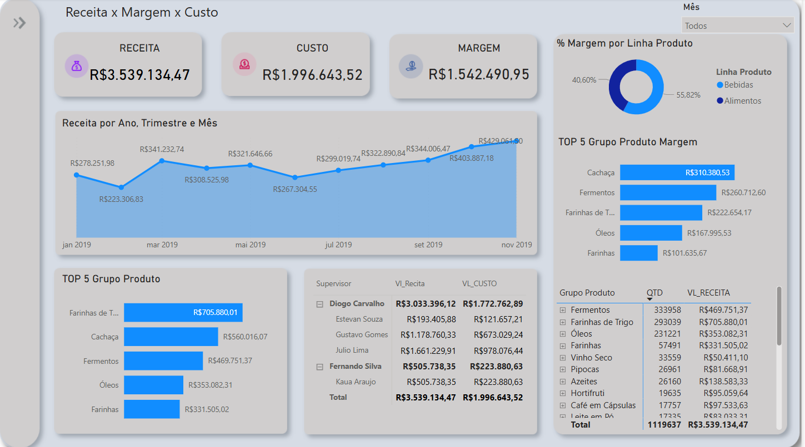

<h1 align="center">📊 Análise de Receita, Margem e Custo</h1>

<p align="center">
Relatório interativo desenvolvido em Power BI para análise estratégica de desempenho financeiro.
</p>

---

## 📌 Objetivo do Projeto

Este projeto tem como foco principal a criação de um painel em Power BI para:

- Avaliar a evolução da **receita** ao longo dos períodos;
- Acompanhar a **margem de lucro** por produto, região ou canal de venda;
- Identificar os principais **custos operacionais** e seu impacto na lucratividade;
- Gerar **insights estratégicos e interativos** para tomada de decisão empresarial.

---

## 🖼️ Preview do Relatório



> 📎 O print do relatório deve ser salvo na pasta raiz como `relatorio.png`. Você pode atualizar com outros ângulos ou páginas do relatório, se quiser.

---

## 📁 Arquivo Principal

- `Analise_Receita_Margem_Custo.pbix`: Arquivo principal do Power BI com todas as **medidas DAX**, transformações em **Power Query** e **visualizações** necessárias para a análise.

---

## 🔍 Funcionalidades

- Filtros por **período**, **região**, **produto** e **canal de venda**;
- Indicadores de desempenho (KPIs):  
  - Receita Total  
  - Custo Total  
  - Margem (%)  
  - Lucro
- Gráficos comparativos, tendências e análises visuais;
- Tabelas dinâmicas e segmentações para análise detalhada.

---

## 🧠 Tecnologias Utilizadas

- [Power BI Desktop](https://powerbi.microsoft.com/)
- Linguagem DAX (Data Analysis Expressions)
- Power Query para ETL (Extração, Transformação e Carga de Dados)

---
---

## 📄 Licença

Este projeto está licenciado sob a Licença MIT - veja o arquivo [LICENSE](LICENSE) para detalhes.


## 🚀 Como Usar
```bash
1. Faça o download ou clone este repositório:

   git clone https://github.com/tiago639/Analise-Receita-Margem-Custo.git

2.Extraia os arquivos de dados necessários:

🔸CadastroProdutos.xlsx
🔸BaseVendasCompleta.xlsx

🔸 Coloque ambos os arquivos na mesma pasta onde está o .pbix
🔸 Certifique-se de que os nomes dos arquivos estejam corretos e sem espaços extras.

3.Abra o Power BI Desktop e carregue o arquivo:

🔸Analise_Receita_Margem_Custo.pbix

4.Atualize as conexões de dados se necessário (Power BI pedirá para confirmar o caminho dos arquivos);

5.Explore o painel interagindo com filtros e visualizações.
```
## 👤 Autor

**Tiago Fonseca**
